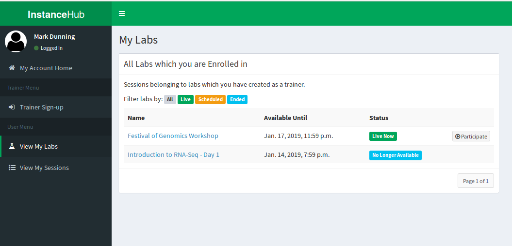
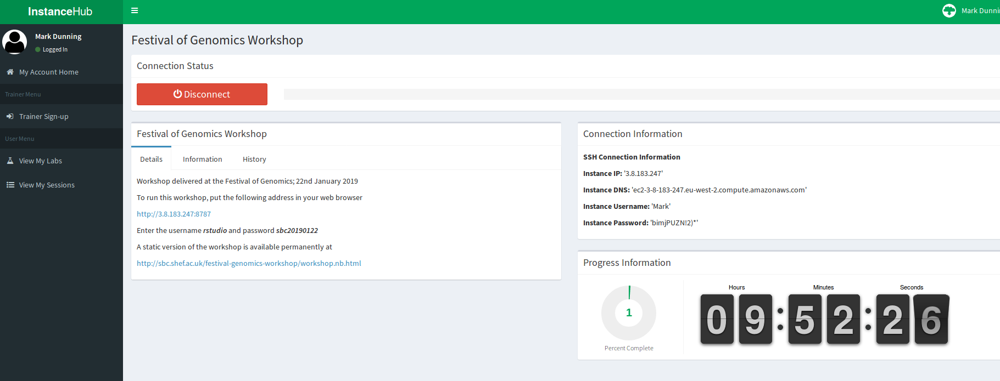
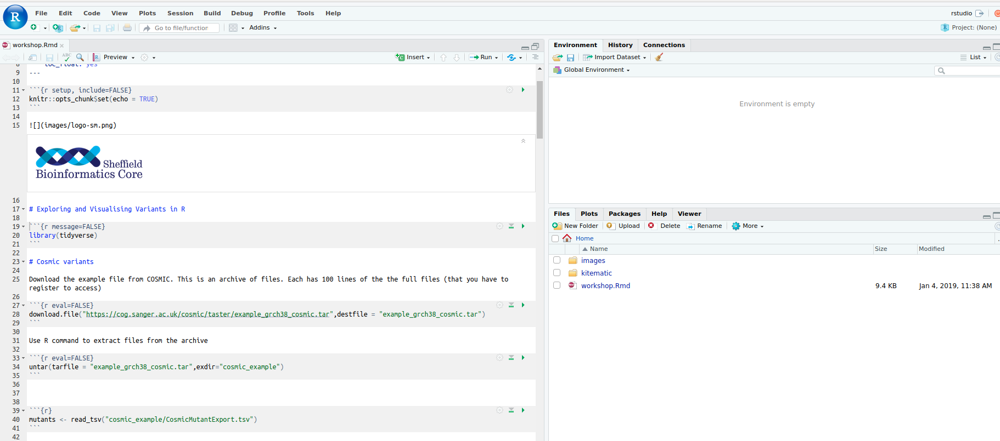

```{r setup, include=FALSE}
knitr::opts_chunk$set(echo = TRUE)
```

# Setup for Festival of Genomics Workshop 22nd January 2019

In this course we will demonstrate how the R programming language can manipulate data that might arise from an NGS study to identify DNA mutations.

The length of the workshop is quite short, so we can setup some computing resources that you can use to access the materials. Please follow the instructions below at your soonest convenience on 22nd January.

## 1. Create an account at InstanceHub

*InstanceHub* is a tool created at The University of Sheffield for creating cloud resources for computing practicals. You will need to go to [instancehub.com](instancehub.com) and create an account. **Make sure that you specify the same email address that you signed-up to the course**.


## 2. Launch the Lab 

Choose the menu option *View my labs* on the left-hand menu. The lab **Festival of Genomics Workshop** should be visible. Click the *Participate* button.



## 3. Connect to the lab

Press the *Start Lab* (green) button and wait whilst the lab loads...


Once *Start Lab* has been replaced by *Disconnect*, the *Connection Information* tab will be updated with an IP address etc.



Enter the following address in your web browser 

Replacing **IP_ADDRESS** with the numbers next to **Instance IP** in the *Connection Information* box.

```
http://IP_ADDRESS:8787
```

e.g. 

```
http://3.8.183.247:8787
```

**Do not click Disconnect**

## 4. Click the file `workshop.Rmd`

You should now have a version of the RStudio interface open in your web browser with all the R code and packages that we are going to need. 



## Installation on your own machine after the workshop

### Windows

Install R by downloading and running [this .exe](http://cran.r-project.org/bin/windows/base/release.htm) file from CRAN. Also, please download and run the [RStudio installer for Windows](https://www.rstudio.com/products/rstudio/download/#download). Note that if you have separate user and admin accounts, you should run the installers as administrator (right-click on .exe file and select “Run as administrator” instead of double-clicking). Otherwise problems may occur later, for example when installing R packages.

Then open RStudio and paste the following lines of R code into a console and press Enter

```{r eval=FALSE}
install.packages("BiocManager")
BiocManager::install("tidyverse")
BiocManager::install("VariantAnnotation", version = "3.8")
BiocManager::install("TxDb.Hsapiens.UCSC.hg19.knownGene", version = "3.8")
BiocManager::install("org.Hs.eg.db", version = "3.8")
BiocManager::install("BSgenome.Hsapiens.UCSC.hg19", version = "3.8")
```


### Mac

Install R by downloading and running [this .pkg](http://cran.r-project.org/bin/macosx/R-latest.pkg) file from CRAN. Also, please download and run [the RStudio installer for Mac](https://www.rstudio.com/products/rstudio/download/#download)

Then open RStudio and paste the following lines of R code into a console and press Enter

```{r eval=FALSE}
install.packages("BiocManager")
BiocManager::install("tidyverse")
BiocManager::install("VariantAnnotation", version = "3.8")
BiocManager::install("TxDb.Hsapiens.UCSC.hg19.knownGene", version = "3.8")
BiocManager::install("org.Hs.eg.db", version = "3.8")
BiocManager::install("BSgenome.Hsapiens.UCSC.hg19", version = "3.8")
```

