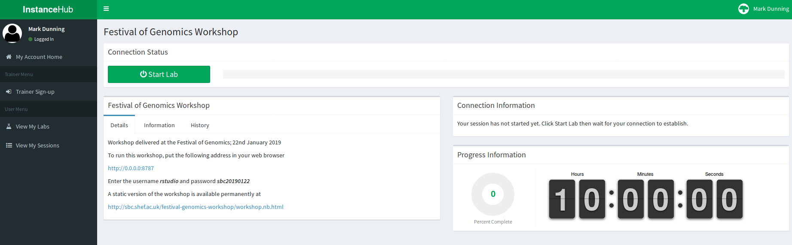

```{r setup, include=FALSE}
knitr::opts_chunk$set(echo = TRUE)
```

# Setup for Festival of Genomics Workshop 22nd January 2019

In this course we will demonstrate how to run some standard analysis tools for RNA-seq data. The majority of Bioinformatics tools are built with a *command-line* environment in mind, rather than Windows or Mac OSX. To simplify the installation of these tools, we are providing some resources on the *cloud* that you can log into for the duration of the course. 

## 1. Create an account at InstanceHub

*InstanceHub* is a tool created at The University of Sheffield for creating cloud resources for computing practicals. You will need to go to [instancehub.com](instancehub.com) and create an account. **Make sure that you specify the same email address that you signed-up to the course**.


## 2. Launch the Lab 

Choose the menu option *View my labs* on the left-hand menu. The lab **Festival of Genomics Workshop** should be visible. Click the *Participate* button.


## 3. Connect to the lab

Press the *Start Lab* (green) button and wait whilst the lab loads...



Once *Start Lab* has been replaced by *Disconnect*, the *Connection Information* tab will be updated with an IP address etc.


Enter the following address in your web browser 

Replacing **IP_ADDRESS** with the numbers next to **Instance IP** in the *Connection Information* box.

```
http://IP_ADDRESS:8787
```

e.g. 

```
http://3.8.183.247:8787
```

**Do not click Disconnect**

## 4. Click the file `workshop.Rmd`

You should now have a version of the RStudio interface open in your web browser with all the R code and packages that we are going to need. 

