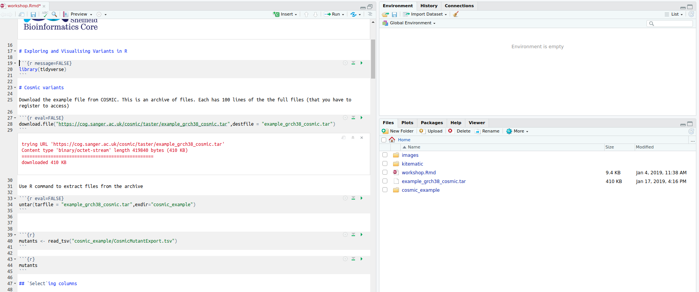

```{r setup, include=FALSE}
knitr::opts_chunk$set(echo = TRUE)
```


# Hello World!

You are looking at an interactive *notebook* that comprises R code and free text. It can be used to document your analyses and produce reports. An R code chunk looks like this :- `r emo::ji("down")`

```{r}

```

Any R code can be *executed* be placing your cursor on the same and pressing **CTRL** and **ENTER**, or clicking the green triangle on the right of the pane.

**Try this now**


```{r}
print("Hello World")
```


`r emo::ji("tada")`

# Exploring and Visualising Variants in R

R has a rich heritage of packages for manipulating and visualising data and performing statistical analysis. One particular set of packages, the *tidyverse* has gained a lot of attention recently as it supports a lot of common data manipulation operations.


This [cheatsheet](https://www.rstudio.com/wp-content/uploads/2015/02/data-wrangling-cheatsheet.pdf) summarises the main data manipulation functions of the package and the [documentation](https://www.tidyverse.org/) is excellent.

The tidyverse functionality is not automatically built into R. We have to load the *tidyverse* library every time we start R.

```{r message=FALSE}
library(tidyverse)
```


# Cosmic variants

We will illustrate some of the main functions from tidyverse with example data from [COSMIC](https://cancer.sanger.ac.uk/cosmic). An example file is freely available, but you will need to register for full-size file. This is an archive of files. Each has 100 lines of the the full files (that you have to register to access)

`download.file` is an R *function* for downloading a file into your *working directory* (the directory where R is currently looking to open files from, and save files to).

```{r eval=FALSE}
download.file("https://cog.sanger.ac.uk/cosmic/taster/example_grch38_cosmic.tar",destfile = "example_grch38_cosmic.tar")
```

We use R function, `untar` to extract files from the archive. You should see that a `cosmic_example` directory has been created.

```{r eval=FALSE}
untar(tarfile = "example_grch38_cosmic.tar",exdir="cosmic_example")
```



We import data so that we can analyse it in R using one of the various functions that are called `read_..`. The choice depends on the type of file (csv, tsv, etc...)

```{r}
mutants <- read_tsv("cosmic_example/CosmicMutantExport.tsv")
```

The `<-` symbol means that we are storing the data in R's memory for future use. Whenever we want to see what the data look like, or manipulate them, we can use the name of the *"variable"* that we have specified; `mutants`.

This prints the data to the screen, but in a clever way so that we can cycle through the entries.

```{r}
mutants
```

`mutants` is an example of a *data frame*, which is R's way of storing tabular data where we potentially have different types of data (text, numbers, dates) in each column.

## `Select`ing columns

We can use the `select` function to print only the columns we are interested in by listing their names with a `,` in between. Column names with a space need to have single quote marks around them `\``

```{r}
select(mutants, `Gene name`, `Primary site`, `Mutation ID`)
```

If the columns we want are consecutive there is a handy shortcut of `:`

```{r}
select(mutants, `Gene name`:`Sample name`)
```

Or if we known that the columns all have a particular name in common.

```{r}
select(mutants, contains("Mutation"))
```


## `filter`ing the rows

The `select` function prints all the rows to the screen. There are many ocassions when we might want to print rows that meet a certain criteria. 

*e.g. to find all mutations that are pathogenic.*

The `==` symbol is used to test what entries in the `FATHMM prediction` column are the same as `PATHOGENIC`

```{r}
filter(mutants, `FATHMM prediction`=="PATHOGENIC")
```

Similar example but looking for a given gene

```{r}
filter(mutants, `Gene name`=="CMYA5")
```

`filter` can also be used when we have numeric data

*e.g. what mutations occur in individuals under 50*

```{r}
filter(mutants, Age<50)
```

## Modifying the columns

The `mutate` function can be used to add new columns based on existing ones. An extremely useful function is `separate` that can split columns that appear to contain more than one piece of information. 

*e.g. extract chromosome, start and end from the genome location*


```{r}
mutants <- separate(mutants, `Mutation genome position`, into= c("Chromosome","Start","End"))
```


## Sorting the data

Data can be sorted according to column with the `arrange` function; either ascending of descending

```{r}
arrange(mutants, `Gene CDS length`)
```


```{r}
arrange(mutants, desc(`Gene CDS length`))
```

Sorting also working on *character* columns

```{r}
arrange(mutants, `Primary site`)
```

## Chaining operations

The real power of tidyverse lies in the fact that we can chain operations together. Consider that we want an output table of all mutants in lung that are pathogenic, ordered by genomic location, displaying only the location, gene name and mutation ID. Using the R code we have written so far we could do this as:-

```{r}
mutants2 <- filter(mutants, `Primary site` == "lung",`FATHMM prediction` == "PATHOGENIC")
mutants3 <- arrange(mutants2,Chromosome,Start)
mutants4 <- select(mutants3,Chromosome,Start,`Gene name`, `Mutation ID`, `Mutation CDS`)
mutants4
```

The `%>%` operation allows us to write one line of R code that follows on from the previous. This results in "cleaner" code that is easier to read and doesn't require us to create lots of variables that are only used once. In this case, our dataset is quite small. For larger datasets we wouldn't really want to create too more copies than necessary.

```{r}

filter(mutants, `Primary site` == "lung",`FATHMM prediction` == "PATHOGENIC") %>% 
  arrange(Chromosome, Start) %>% 
  select(`Gene name`, `Mutation ID`, `Mutation CDS`)

```

## Plotting

The tidyverse also provides visualisation via the `ggplot` function. The plotting is extremely flexible and can create publication-ready graphics. There is a useful [cheatsheet]()

The `gg` in `ggplot` stands for "grammar of graphics" and allows us to "map" between variables in our dataset (such as the `mutants` data we have already been working with).

*e.g. creating a barplot to show the frequency of various mutation types*

```{r}
ggplot(mutants, aes(x=`FATHMM prediction`)) + geom_bar()
```

`mutants` is the data that we want to plot; `FATHMM prediction` is the variable we want to show on the x-axis and `geom_bar` is the way that we want to display the data. We will re-visit other plotting types when we have imported a larger version of this dataset.

## Accessing the larger dataset

Accessing the full dataset requires registration with COSMIC. Assuming you have completed that process you should be able to download a file `CosmicMutantExportConsensus.tsv.gz` containing all mutants in the Cancer Gene Consensus. This can be found under the heading **All Mutations in Census Genes**. It is around 40MB so takes a little bit of time to read into R.

(even though the file is compressed (`.gz`) we can still read it into R)

We use the same `read_tsv` command with the path to the new file.

```{r eval=FALSE}
consensus_mutants <- read_tsv("CosmicMutantExportCensus.tsv.gz")
```


```{r echo=FALSE}
consensus_mutants <- read_tsv("CosmicMutantExportCensus.tsv.gz",progress = FALSE)
```

The data frame object now has 700K rows
```{r}
consensus_mutants
```

The same `select`, `filter` etc operations apply.

*e.g. What mutations are recorded for `TP53`?*

```{r}
filter(consensus_mutants, `Gene name`=="TP53")
```

*e.g. What is the most commonly mutated gene in breast cancer?*

Here we can use a handy function `count` to count the number of time unique entries in a particular column occur

```{r}
filter(consensus_mutants, `Primary site`=="breast") %>% 
  count(`Gene name`) %>% 
  arrange(desc(n))
```

The `%>%` operation allows us to plot that data frames that we have manipulated with `filter` etc.

*e.g. gWhat cancer types is TP53 most commonly mutated in?*

```{r}
filter(consensus_mutants, `Gene name`=="TP53") %>% 
  ggplot(aes(x=`Primary site`)) + geom_bar()
```

There are a few too many sites to see the plot properly, so we can further filter and also flip the axis so it is easier to read

```{r}
filter(consensus_mutants, `Gene name`=="TP53") %>% 
  count(`Primary site`) %>% 
  filter(n > 1000) %>% 
    ggplot(aes(x=`Primary site`,y=n)) + geom_bar(stat="identity") + coord_flip()
```

The ordering of the bars is alphabetical by default. But it is more natural to reorder according to the counts.

```{r}
filter(consensus_mutants, `Gene name`=="TP53") %>% 
  count(`Primary site`) %>% 
  filter(n > 1000) %>% 
    ggplot(aes(x=reorder(`Primary site`,n),y=n)) + geom_bar(stat="identity") + coord_flip()
```


Do TP53 mutations have a different age distribution in different cancer types?

```{r}
filter(consensus_mutants, `Gene name`=="TP53") %>% 
  ggplot(aes(x=`Primary site`,y=Age)) + geom_boxplot() + coord_flip()
```


# Annotating vcf files

We will use the somatic calls that have previously been made for the *HCC1143* breast cancer cell line. The calls were made as part of a Cancer Research Uk Bioinformatics Summer School.

The following workflow will be used:- 

- importing raw vcf calls with `VariantAnnotation`
- use the transcript database package `TxDb....` to annotate variants within coding regions
- use the genome sequence package `Bsgenome....` to assess function
- use the genome annotation package `org.Hs.eg.db` to convert to recognisable gene symbols
- join the tables with `dplyr` and use the functions from the previous section


```{r message=FALSE,eval=FALSE}
url <- "https://github.com/bioinformatics-core-shared-training/cruk-summer-school-2016/raw/master/Day3/HCC1143_vs_HCC1143_BL.flagged.muts.vcf"
download.file(url, destfile="HCC1143_vs_HCC1143_BL.flagged.muts.vcf")

```

The `VariantAnnotation` package can be used to import the data into R. This package is distributed as part of the Bioconductor project.

```{r message=FALSE}
library(VariantAnnotation)
raw_vcf <- readVcf("HCC1143_vs_HCC1143_BL.flagged.muts.vcf")

```

To make the process go more smoothly, we will consider variants on chromosomes 1 to 22 only. The naming convention of the chromosomes also needs to be changed to be compatible with the annotation resources we are going to use.

```{r}
raw_vcf <- keepSeqlevels(raw_vcf, 1:22,pruning.mode = "coarse")
seqlevelsStyle(raw_vcf) <- "UCSC"
genome(raw_vcf) <- "hg19"
```


The location of the variants can be returned using the `rowRanges` function that is part of `VariantAnnotation`.

```{r}
var_locs <- rowRanges(raw_vcf)
var_locs
```

We notice that the vcf file already has some filters applied for quality. Variants that pass all the filters have an entry of `PASS`. We will use these variants in subsequent analyses.

N.B. the data aren't yet in a form that we can use the `dplyr` operations from previously, so we have to use a different approach to filter the rows.

```{r}
pass_vcf <- raw_vcf[var_locs$FILTER == "PASS"]
pass_locs <- rowRanges(pass_vcf)
```

The Bioconductor project also distributes several annotation packages that can be used to annotate our results. The collection of `TxDb....` packages comprise definitions of transcripts for a given genome build.

```{r message=FALSE}
library(TxDb.Hsapiens.UCSC.hg19.knownGene)
txdb <- TxDb.Hsapiens.UCSC.hg19.knownGene
```

The `locateVariants` function can be used to find the variants. Various types of match including `CodingVariants` that will find variants inside coding regions. The output is converted to a data frame so we can use the `dplyr` functions we saw earlier

We clean-up the output so only certain columns are displayed. The `QUERYID` column needs to be kept to refer back to the complete set of variants in the filtered vcf file.

```{r message=FALSE}
var_annotations <- locateVariants(pass_locs, txdb, CodingVariants())
var_annotations <- as.data.frame(var_annotations) %>%
  dplyr::select(QUERYID,GENEID) %>% unique %>% 
  filter(!is.na(GENEID))
var_annotations
```

With the `predictCoding` function we can assess whether the mutations are going to result in amino acid change or not. This makes use of the Genome sequence, which is available in the `BSgenome.Hsapiens.UCSC.hg19` package.

Again we only use certain columns from the output.

```{r message=FALSE}
library(BSgenome.Hsapiens.UCSC.hg19)
var_predictions <- predictCoding(pass_vcf, txdb, seqSource = Hsapiens)
names(var_predictions) <- make.names(names(var_predictions),unique = TRUE)
var_predictions <- as.data.frame(var_predictions) %>% 
  select(QUERYID,CONSEQUENCE,REFCODON,VARCODON,REFAA,VARAA) %>% unique
var_predictions
```

Now the data are in data frames, we can join the two tables together with `dplyr`.

```{r}
var_annotations <- left_join(var_annotations,var_predictions,by="QUERYID")
var_annotations


```

The gene names are currently Entrez ID, which although useful for mapping, do not give particularly memorable names that we can search for. We use a pre-built annotation package `org.Hs.eg.db` to obtain gene symbols.

```{r}
library(org.Hs.eg.db)
gene_anno <- AnnotationDbi::select(org.Hs.eg.db,
                                   columns="SYMBOL",
                                   keys=var_annotations$GENEID,
                                   keytype = "ENTREZID") 
gene_anno <- rename(gene_anno, "GENEID"=ENTREZID)

var_annotations <- left_join(var_annotations, gene_anno) %>% unique
var_annotations
```

We can put everything together into one table. The locations from the vcf need to be converted into a data frame including a `QUERYID` column that can be matched to the annotations. This is defined to be the row number.

```{r}
final_tab <- as.data.frame(pass_locs) %>% 
  mutate(QUERYID = 1:n()) %>% select(-width,-paramRangeID,-ALT,-QUAL,-FILTER,-strand) %>% 
  inner_join(var_annotations, by="QUERYID") %>% 
  select(seqnames:end,SYMBOL,REF:VARAA,-QUERYID)
final_tab
```

The `dplyr` functions and `ggplot2` introduced in the previous section can now be applied to our list of variants.

```{r}
filter(final_tab, CONSEQUENCE=="nonsense")
```

What genes are most commonly mutated?

```{r}
count(final_tab, SYMBOL) %>% arrange(desc(n))
```


How many variants are located on each chromosome?

```{r fig.width=12}
ggplot(final_tab, aes(x=seqnames,fill=CONSEQUENCE)) + geom_bar(position="dodge") + coord_flip()
```

